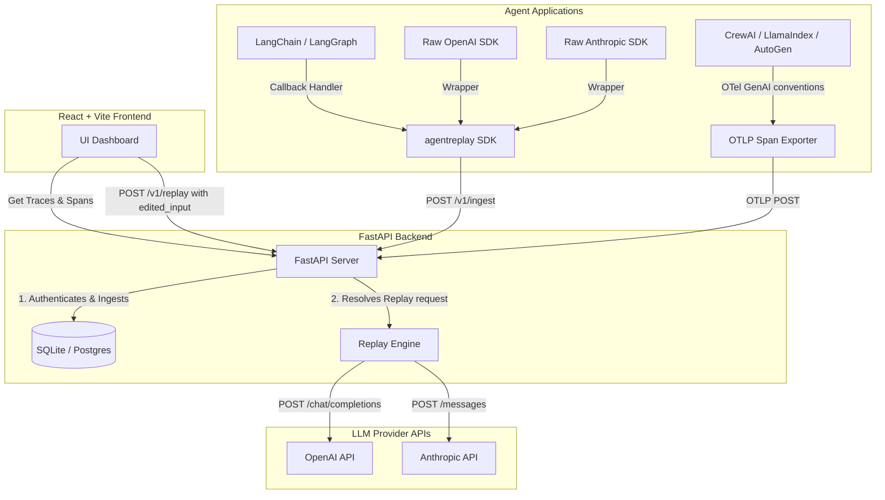

# 🧭 Statica Trace

> **Statica Trace** is a developer-focused Agent Replay Debugger. It captures complete execution traces from AI agent frameworks and lets developers inspect, edit, and re-run individual steps (LLM calls) against live provider APIs, showing a side-by-side diff between original and replayed outputs.

---

## 📖 Table of Contents
- [✨ Key Features](#-key-features)
- [🏗️ System Architecture](#️-system-architecture)
- [📁 Project Layout](#-project-layout)
- [⚙️ Setup & Installation](#️-setup-&-installation)
- [🧪 Running Tests](#-running-tests)
- [🗺️ Implementation Roadmap](#️-implementation-roadmap)
- [📄 Documentation](#-documentation)

---

## ✨ Key Features

1. **Structured Trace Capture**: Normalizes complex agent traces from LangChain/LangGraph, raw SDK loops, or OpenTelemetry (OTel) GenAI convention spans into a single flat trace schema.
2. **Step-Level Live Replay**: Open any historical or failing run, modify the exact inputs (system prompts, user messages, model parameters, tool schemas), and re-run *just that step* against live LLM providers.
3. **API Key Safety**: Executes replay calls using the developer's provider API key passed per-request (via the `X-Provider-Api-Key` header). Provider keys are **never stored** on the server.
4. **Visual Diffing**: Shows side-by-side output comparison (text content and tool invocation payloads) between original runs and replayed runs.

---

## 🏗️ System Architecture

Statica Trace separates instrumentation/ingest from replay execution and trace visualization:



---

## 📁 Project Layout

Here is the high-level outline of the repository:

*   📂 [agentreplay/](file:///Users/angel/Documents/repo/agentreplay) — Python capture SDK (under development).
    *   📄 [agentreplay/schema.py](file:///Users/angel/Documents/repo/agentreplay/schema.py) — Canonical Pydantic models for traces, spans, and inputs/outputs.
*   📂 [backend/](file:///Users/angel/Documents/repo/backend) — FastAPI server, database schema, and live replay execution engine.
    *   📄 [backend/main.py](file:///Users/angel/Documents/repo/backend/main.py) — API endpoints (`/v1/projects`, `/v1/ingest`, `/v1/traces`, `/v1/replay`).
    *   📄 [backend/replay_engine.py](file:///Users/angel/Documents/repo/backend/replay_engine.py) — Core logic to reconstruct calls and invoke OpenAI/Anthropic.
    *   📄 [backend/database.py](file:///Users/angel/Documents/repo/backend/database.py) — Database session management and table initializations.
    *   📄 [backend/models.py](file:///Users/angel/Documents/repo/backend/models.py) — SQLAlchemy models for projects, traces, and replay logs.
    *   📄 [backend/schemas.py](file:///Users/angel/Documents/repo/backend/schemas.py) — Pydantic models for API request/response validation.
    *   📄 [backend/auth.py](file:///Users/angel/Documents/repo/backend/auth.py) — API key verification and endpoint dependency injections.
*   📂 [frontend/](file:///Users/angel/Documents/repo/frontend) — Vite-based React single-page application dashboard.
    *   📂 [frontend/src/](file:///Users/angel/Documents/repo/frontend/src) — React components and pages.
    *   📄 [frontend/vitest.config.ts](file:///Users/angel/Documents/repo/frontend/vitest.config.ts) — Component test configuration.
    *   📄 [frontend/playwright.config.ts](file:///Users/angel/Documents/repo/frontend/playwright.config.ts) — End-to-end integration testing config.
*   📂 [tests/](file:///Users/angel/Documents/repo/tests) — Backend unit and integration tests.
*   📂 [DOCS/](file:///Users/angel/Documents/repo/DOCS) — Specifications and design documents.
    *   📄 [DOCS/agent-replay-debugger-spec.md](file:///Users/angel/Documents/repo/DOCS/agent-replay-debugger-spec.md) — Product requirements document.
    *   📄 [DOCS/design-system-doc.md](file:///Users/angel/Documents/repo/DOCS/design-system-doc.md) — Design system layout guide.
*   📄 [backlog.md](file:///Users/angel/Documents/repo/backlog.md) — Multi-sprint project implementation checklist.
*   📄 [pyproject.toml](file:///Users/angel/Documents/repo/pyproject.toml) — Python build tools, dependencies, and formatting configurations.
*   📄 [Makefile](file:///Users/angel/Documents/repo/Makefile) — Common helper commands (linting, test execution).

---

## ⚙️ Setup & Installation

### Prerequisite Versions
*   **Python**: `>= 3.11`
*   **Node.js**: `>= 18`

---

### 🐍 1. Backend Setup

1.  **Create and activate a virtual environment**:
    ```bash
    python3 -m venv .venv
    source .venv/bin/activate
    ```

2.  **Install dependencies in editable dev mode**:
    ```bash
    make install
    ```

3.  **Run backend database migrations / table creation**:
    FastAPI will automatically create tables on startup using SQLAlchemy, but you can check database parameters in [backend/database.py](file:///Users/angel/Documents/repo/backend/database.py). The default is a local SQLite database (`sqlite+aiosqlite:///./statica_trace.db`).

4.  **Start the development server**:
    ```bash
    uvicorn backend.main:app --reload --port 8000
    ```
    The Swagger API documentation will be available at `http://127.0.0.1:8000/docs`.

---

### ⚛️ 2. Frontend Setup

1.  **Navigate to the frontend directory and install dependencies**:
    ```bash
    cd frontend
    npm install
    ```

2.  **Start the frontend development server**:
    ```bash
    npm run dev
    ```
    By default, this launches the dashboard at `http://localhost:5173`.

---

## 🧪 Running Tests

### Python Code Quality & Tests (Backend / SDK)
*   **Format and Lint Check**:
    ```bash
    make lint
    ```
*   **Run Auto-Formatters (`ruff` and `black`)**:
    ```bash
    make fmt
    ```
*   **Run pytest Suite (unit and integration tests)**:
    ```bash
    make test
    ```
    *(Enforces a minimum code coverage threshold of 80%)*

### Javascript / React Tests (Frontend)
*   **Run Vitest Unit Tests**:
    ```bash
    cd frontend
    npm run test
    ```
*   **Run Playwright E2E Tests**:
    ```bash
    cd frontend
    npm run test:e2e
    ```

---

## 🗺️ Implementation Roadmap

Below is the current project progress tracked in [backlog.md](file:///Users/angel/Documents/repo/backlog.md):

| Module | Scope | Status | Notes |
| :--- | :--- | :--- | :--- |
| **Module 0** | Tooling & Test Infrastructure | ✅ Completed | Setup `ruff`/`black` formatters, `pytest`, `Vitest`, `Playwright`. |
| **Module 1** | Foundation & Data Model | ✅ Completed | Created trace, span, and message schemas in [agentreplay/schema.py](file:///Users/angel/Documents/repo/agentreplay/schema.py). |
| **Module 2** | Backend APIs & Replay Engine | ✅ Completed | Projects, Authentication, Ingest, Traces, and LLM Replay Engine. |
| **Module 3** | Python Capture SDK (`agentreplay`) | 📅 In Backlog | Scaffolding, buffer batching, LangChain callbacks, client SDK. |
| **Module 4** | Frontend Dashboard (UI) | 📅 In Backlog | Tailwind configuration, trace timeline, replay panel, diff views. |
| **Module 5** | Polishing & Deployment | 📅 In Backlog | Empty states, error loading components, deployments. |
| **Module 7** | System Testing | 📅 In Backlog | Docker environment, full end-to-end integration flows. |
| **Module 8** | JS/TS SDK & Advanced Features | 📅 In Backlog | Vercel AI SDK wrapper, persistent provider keys. |

---

## 📄 Documentation

For deep technical details, refer to:
*   [Agent Replay Debugger Specification](file:///Users/angel/Documents/repo/DOCS/agent-replay-debugger-spec.md) — Detailed specifications for database schemas, endpoints, and architectures.
*   [Design System Documentation](file:///Users/angel/Documents/repo/DOCS/design-system-doc.md) — Tokens, UI components, colors, and Tailwind configuration layout.
*   [Agent Integration & Instrumentation Guide](file:///Users/angel/Documents/repo/agents.md) — Technical details of how agent frameworks hook into the debugger.
